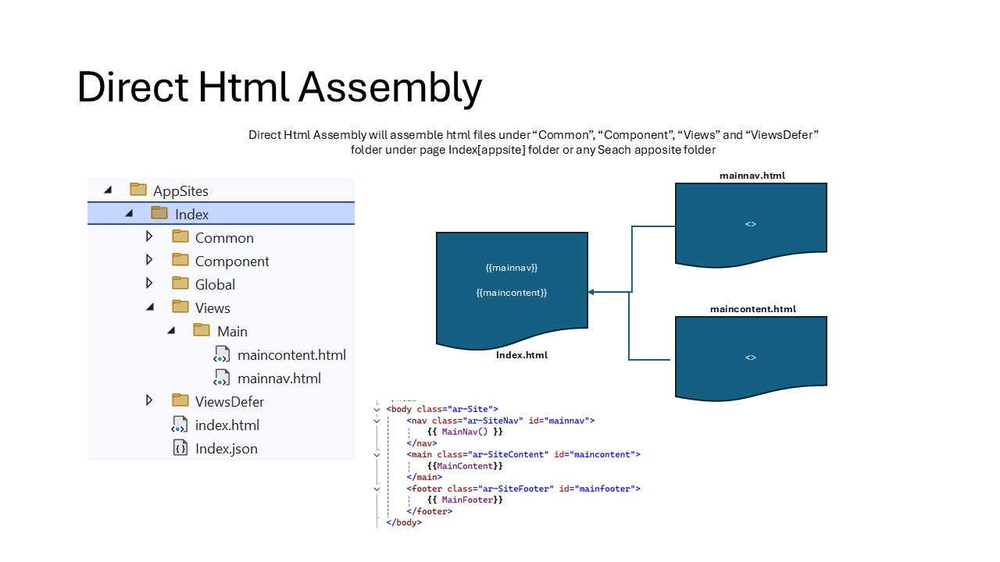
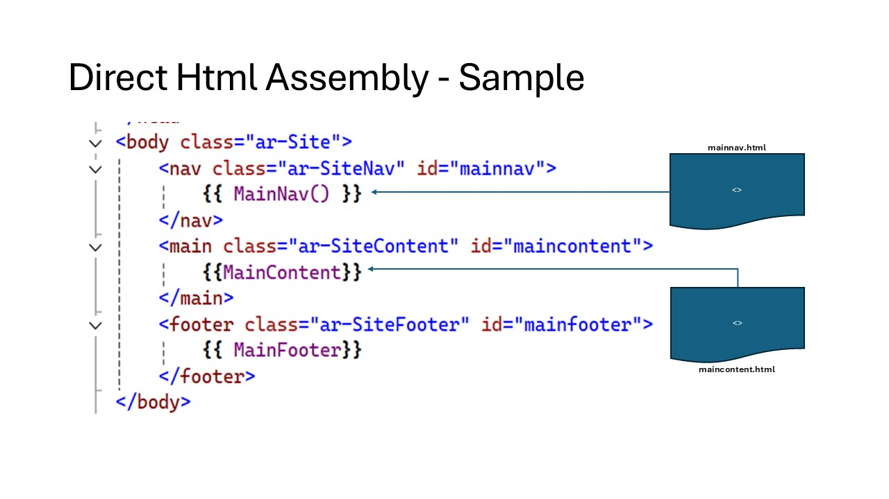
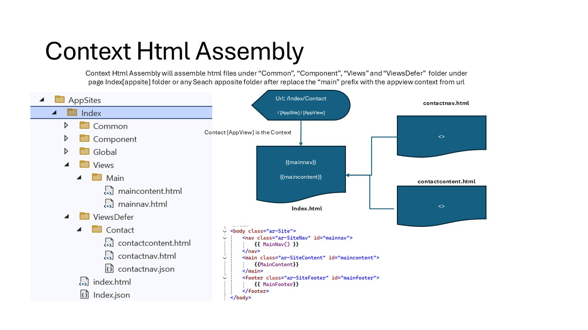
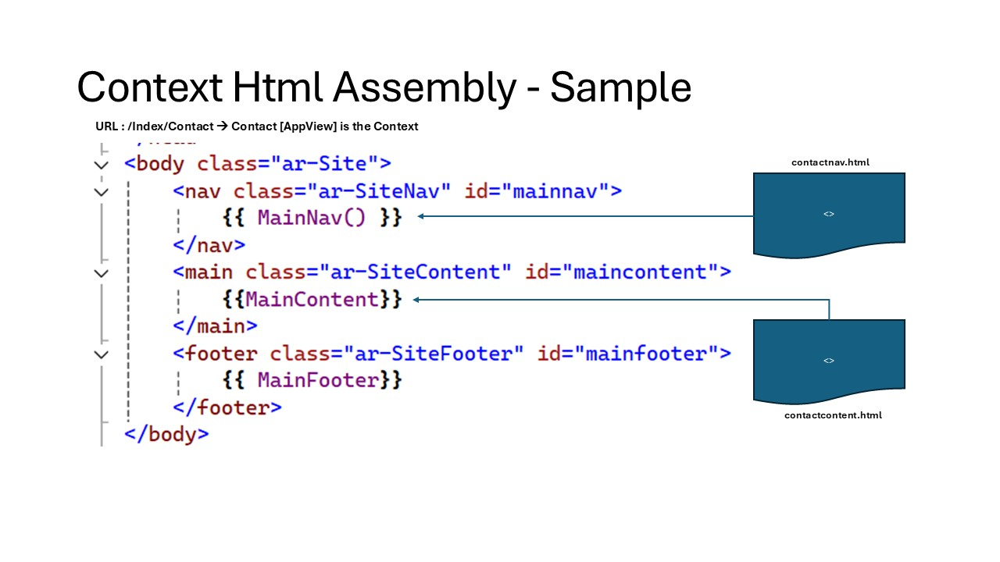
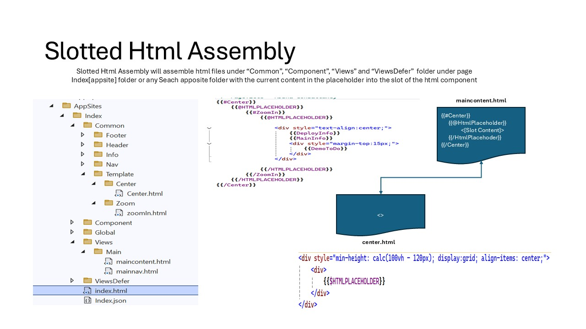
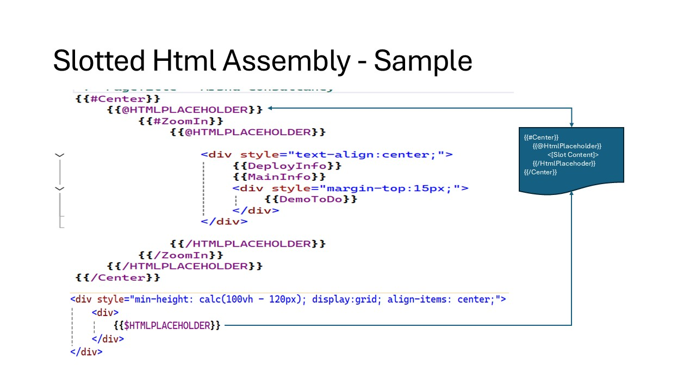

# Abstraction for Assembling Static Data UI from Html Components

 "Assemble Html + Json Overview".

# Abstraction for Assembling Static Html (3 Rules)

1. Html Composition

#### Abstraction for Composing Html with Inner Html Fragments

 "Direct Html Assemble".

 "Direct Html Assemble Sample".

3. Html Context Composition

#### Abstraction for Composing Html Based on Context

 "Context Html Assemble".

 "Context Html Assemble Sample".

2. Html Slotted Composition

#### Abstraction for Composing Inner Html with Inner Html Fragments

 "Slotted Html Assemble".

 "Slotted Html Assemble Sample".
