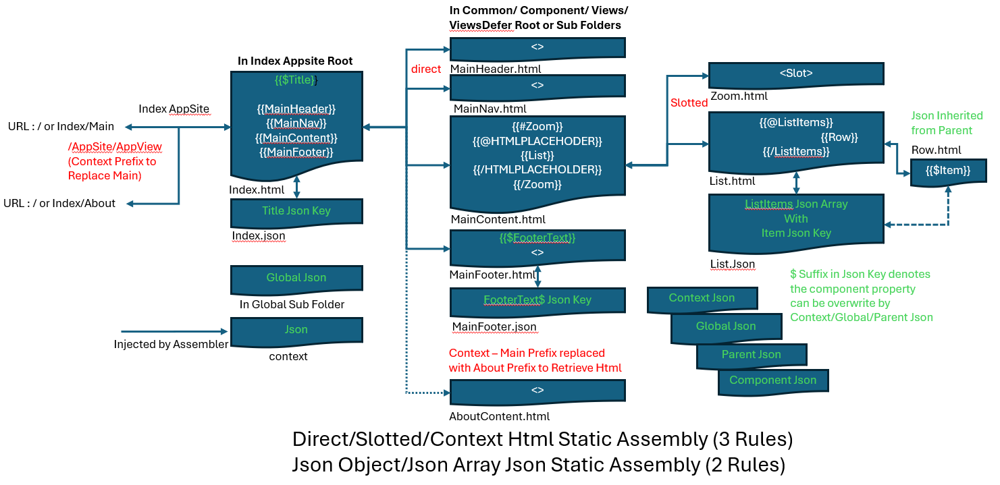

# Abstraction for Assembling Static Data UI from Html Components

 "Assemble Html".

1. Html Composition

#### Abstraction for Composing Html with Inner Html Fragments

<pre>

Title.html
&lt;div&gt; 
     {{TitleContent}}
&lt;/div&gt;     

TitleContent.html
&lt;div&gt; 
     Title
&lt;/div&gt;     

</pre>

2. Html Inner Composition

#### Abstraction for Composing Inner Html with Inner Html Fragments

<pre>

{{#ZoomIn}}
    {{@HTMLPLACEHOLDER}}

Center.html
 &lt;div&gt; 
    {{#Center}}
		{{@HTMLPLACEHOLDER}}
			{{TitleContent}}
		{{/HTMLPLACEHOLDER}}
    {{/Center}}
&lt;/div&gt;     

TitleContent.html
&lt;div&gt; 
     Title
&lt;/div&gt;     

</pre>

