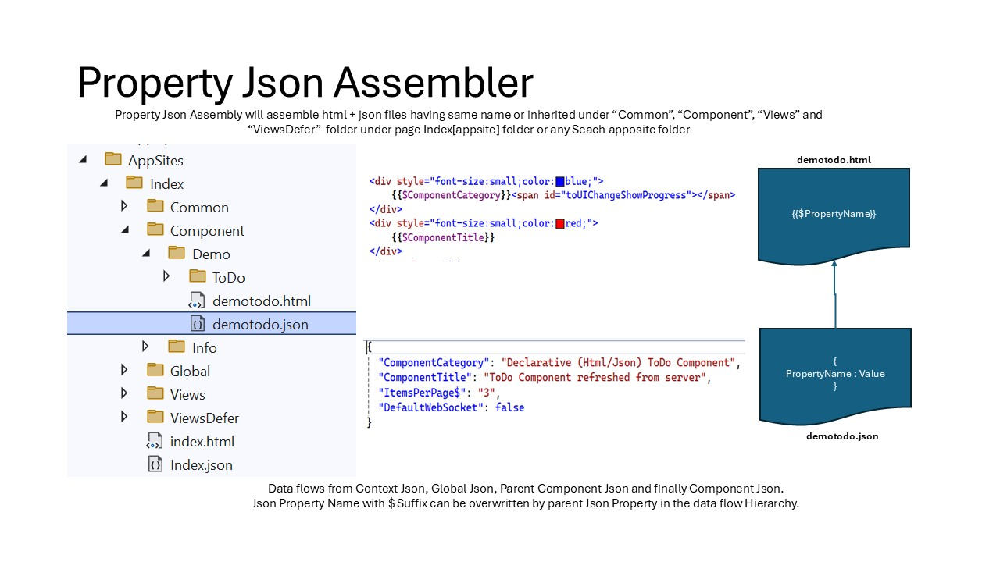
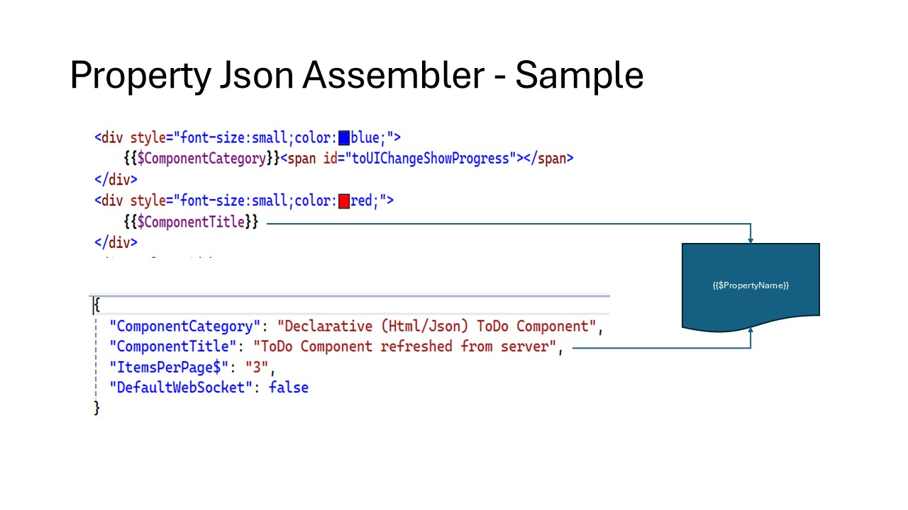
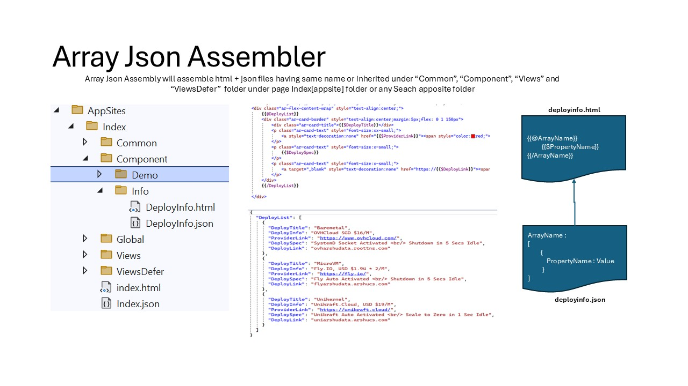
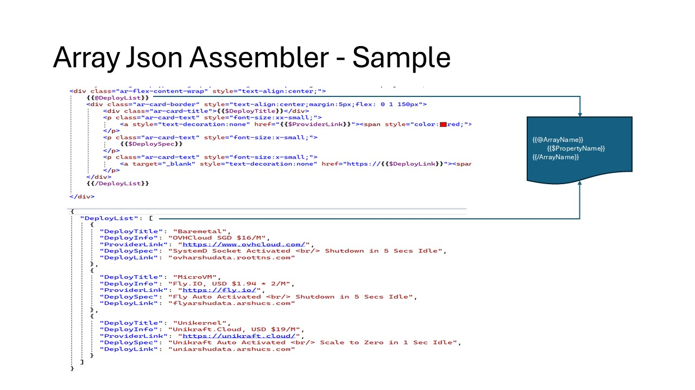

# Abstraction for Assembling Static Data UI from Html + Json Components

 "Assemble Html + Json".

1. Json Property Data Composition

#### Abstraction for Composing from Html + Json Property Fragemnts

 "Html + Json Property Assemble".

 "Html + Json Property Assemble Sample".

2. Json Array Composition

#### Abstraction for Composing from Html + Json Array Fragemnts

 "Html + Json Array Assemble".

 "Html + Json Array Assemble Sample".

3. Data Flow Composition

#### Json Data Values are composed with Html Component based on the below default precedence. The precendence can be changed in configuration.

<pre>

Component State
    Parent Components State                
		Global State            
			Context State
                
</pre>

#### Data Defined at Any Higher Data Level can be Overwriten by the Previous Precedence Data if allowed by $ Suffix to the Json Key of the Component

<pre>

    Title.json
    {
        "Title$" : "Name" 		
    }

	
</pre>

$ Suffix Allow Override with Parent/Context/Global Data if Available